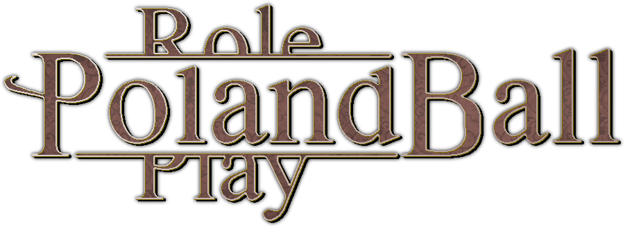

# OpenPolandballRoleplay



A multiplayer social game inspired by Club Penguin, but with Countryballs! Built with Godot Engine.

Polandball Roleplay (PBRP) was originally a closed-source ROBLOX game found 3.14.2015. 

It was prone to drama and mismanagement, therefore it fell in early 2020.

The idea to create the off ROBLOX variety of PBRP was first realized in mid 2020, with work on it beginning in late 2021.
Several prototypes such as Polandball Chat were made, but never released. Footage of it should easily be found on the internet.

This version seeks to become a free and open-source alternative of traditional PBRP made by its own creator (salih1, known as salihkes on GitHub).

## 🎮 Features

- **Multiplayer Social Space**
  - Chat with other players
  - Express emotions through classic Countryball expressions
  - Customize your character with hats and accessories
  - Join or host rooms for roleplay
  - Choose any Countryball that the server owner has added.

- **Building System (Supported, but disabled by default)**
  - Place and color blocks
  - Build together with other players
  - Save and load constructions
  - Create custom environments (Including from heightmaps if you know what you're doing)

- **Dynamic World**
  - Day/night cycle
  - Cloud system
  - Chat bubbles above players

## 🚀 Getting Started

### Important Notes

- **Code Structure**
  - Current codebase is undergoing restructuring
  - Development history:
    - 2021: Original version in GDScript
    - 2022: Rewritten in C#
    - 2023: Translated back to GDScript
    - 2024: Simplified (pending proper restructuring)
  - A formal code convention will be implemented soon

- **Map System**
  - Default map is a basic baseplate
  - Custom maps must be provided as .pck files
  - Map configuration:
    1. Place .pck file in user:// directory
       - macOS: `/Users/yourusername/Library/Application Support/OpenPBRP`
    2. Modify "mapload" in s1sd.gd to reference your map file
    3. Map structure must follow:
       - `res://DynamicMaps/[map_name]/Main.tscn`
       - `[map_name]` must match .pck filename (no spaces/special chars)

The previus versions allowed dynamic map loading via a graphical UI, but it was removed temporarily for ease of use and ease of development.

### Prerequisites
- Godot Engine 3.x
- Python 3.8+ (for server. Miniconda installation recommended.)

### Installation

1. Clone the repository:
```bash
git clone https://github.com/salihkes/OpenPolandballRoleplay.git
```

2. Set up the server:
```bash
cd OpenPolandballRoleplayServer
pip install -r requirements.txt
```

3. Configure SSL:
   - Place your SSL certificate as `cert1.crt`
   - Place your SSL key as `key1.key`

4. Configure the server:
   - Create the 'flags' and 'users' folders.
   - Set admin usernames in `admins` list
   - Configure invite codes if using registration
   - Adjust WebSocket port (default: 8765) and modify the URL in `connecttoserver()` in `game.gd` (the default URL points to wss://yourdomain.com:8765).

### Flag System
The server expects country flags in TGA format in the `flags` folder:
- Format: `countryname.TGA`
- Flags are automatically converted to PNG for clients
- Flags are not included in the repository
- Server owners need to provide their own flag images

### Map System
Maps are stored in two formats:
- `.json` files for map data
- `.pck` files for Godot resource packs

### Security Features
- Password hashing with unique salts
- SSL/TLS encryption
- Temporary and permanent ban systems
- Admin commands for moderation

### Admin Commands
```text
!tempban [username] - Temporarily ban a user (1 hour)
!permban [username] [reason] - Permanently ban a user
```

## 🤝 Contributing

Contributions are welcome! Please feel free to submit a Pull Request.

### Development Guidelines
1. Follow Godot style guide
2. Test multiplayer functionality
3. Document new features
4. Keep performance in mind

## 📝 License

This project uses multiple licenses to ensure community ownership and prevent exploitation in accordance with the manifesto (The manifesto is not included with this project) that caused this project to be made:

### Game Client
Licensed under [GNU AGPL-3.0](LICENSE-CLIENT)
- Source code must remain open
- Modifications must be shared
- Network use requires source sharing

### Server
Licensed under [GNU GPL-3.0](LICENSE-SERVER)
- Server code remains open source
- Community can host their own servers
- Modifications must be shared

### Assets
Licensed under [CC BY-SA 4.0](LICENSE-ASSETS)
- Community can create and share assets
- Attribution required
- Modifications must be shared
- Non-commercial use only

### Exceptions
- Country flags must be provided by server owners
- Commercialization of any kind is not allowed. Server hosts may charge reasonable fees for server maintenance only
- No in-game purchases or virtual currencies allowed

## 🙏 Acknowledgments

- Cloud system implementation from Godot Asset Library
- Community contributors and testers

## 📞 Contact

- Issues: [GitHub Issues](https://github.com/salihkes/OpenPolandballRoleplay/issues)

---

<p align="center">Made with ❤️ by the Polandball Roleplay community</p>